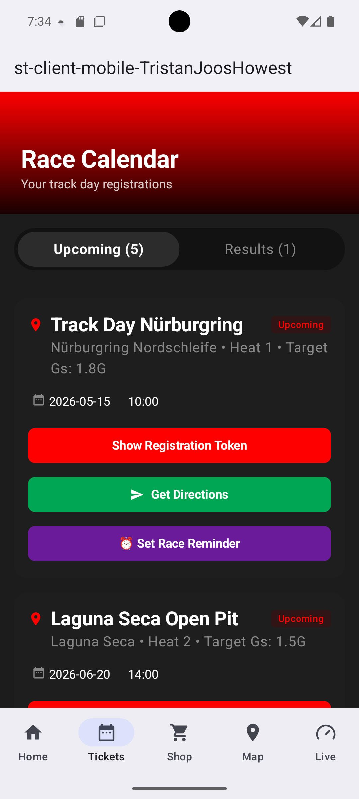
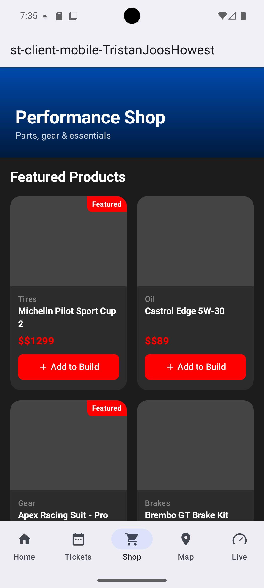
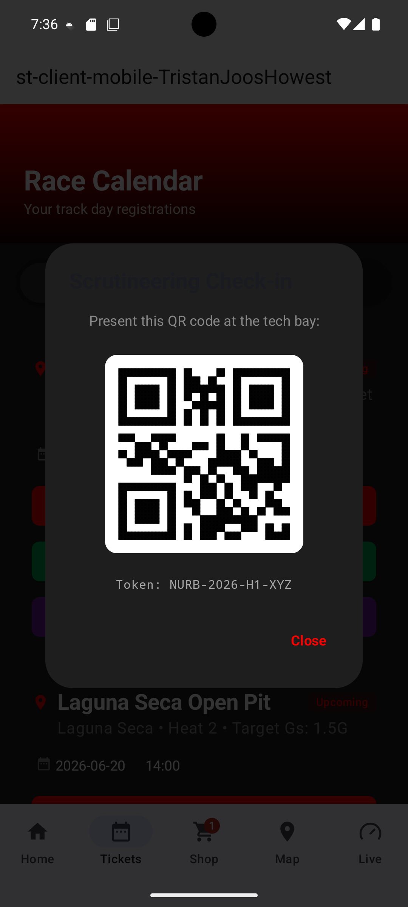
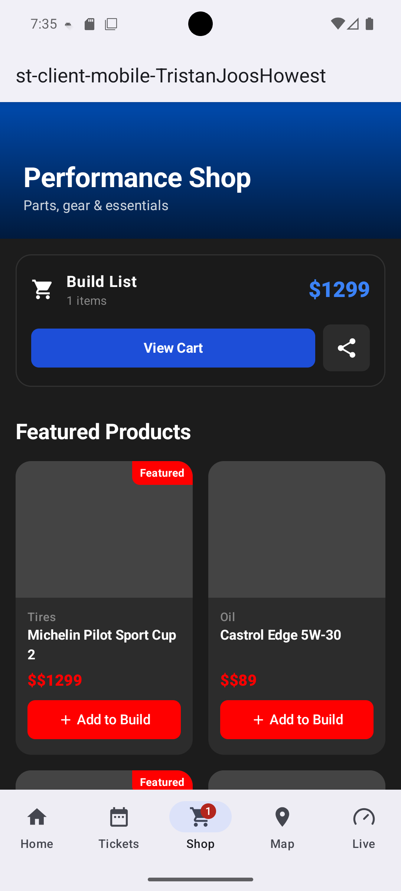
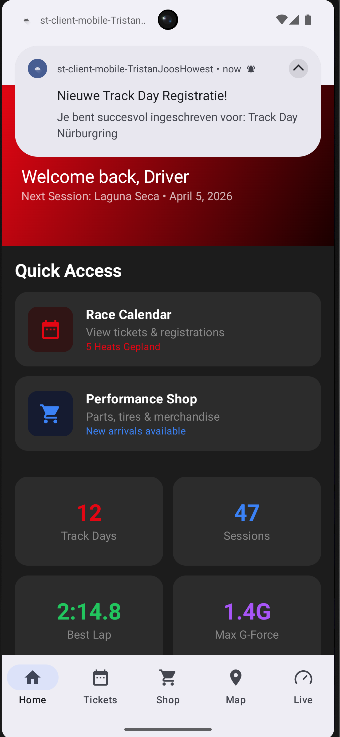
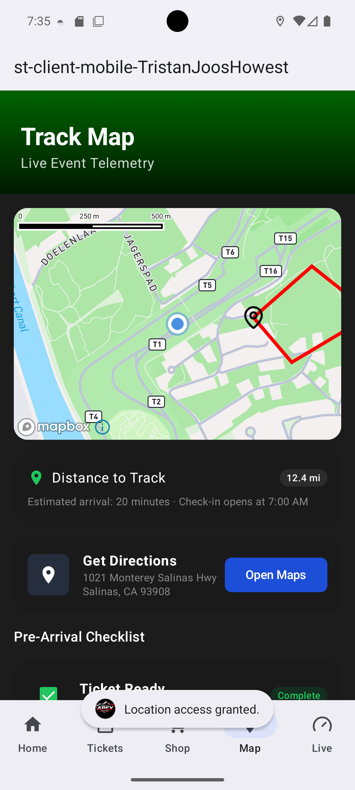
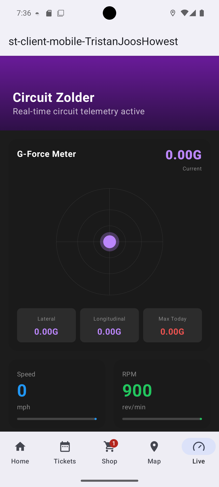
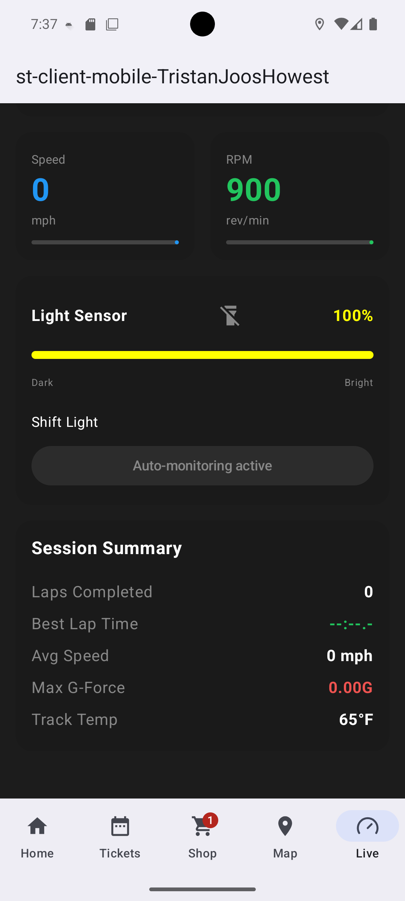

# 🎬 Project Status — Apex Track day

## Author
- Tristan Joos

# Project Summary

The mobile app is responsible for retrieving Apex track day tickets and notifying the user about important events such as payment reminders and track day start reminders.

The app also contains extra features that improve the driving experience for drivers entering the track.

For starting the api + messagebroker do docker compose up in de folder messagebroker api 

# Daily Status

> Update this document **every day**:
> - Describe briefly what you did that day
> - Update the status tables for each feature

## Monday, June 1st, 2026
did nothing only realy looked at what needed to be done and make a planning for the week

## Tuesday, June 2nd, 2026
made the navigation fully work 
## Wednesday, June 3rd, 2026
made the home screen navigation buttons work
Made the ticket screen fully work except for nottifciation setting and a minor bug in qr code
## Thursday, June 4th, 2026
Made the shop page work full except for pictures and also the map feuture full just need the track outline on it and person location and
also made the live telemtry data fully work with the g-force sensor and the spoeed + avg speed track temp via api 
## Friday june 5th, 2026
Makes the nottifications work + also makes the cutsom icon and startup screen work + make the map show the userlocation makes you able to share the build list + implemented unit and instrumented tests for DAOs and LiveViewModel + implemented local Room storage for shop parts + added flashlight toggle functionality.

## Saturday June 6th, 2026 (Refactoring & Architecture)
Applied major architectural improvements:
- **Security**: Moved all hardcoded API URLs and RabbitMQ credentials to `BuildConfig`.
- **Clean Architecture**: Implemented the Repository Pattern with interfaces in a new `domain` layer and moved implementations to the `data` layer, coupled via Hilt `@Binds`.
- **SOLID Principles**: Split the monolithic `SensorRepository` into `HardwareSensorRepository`, `LocationRepository`, and `WeatherRepository` (Single Responsibility).
- **Centralized Permissions**: Refactored permission handling from UI components to a centralized `PermissionManager` and `MainViewModel`.
- **Consistency**: Standardized all network communication to use **Moshi** (removed Gson).
- **Clean Code**: Eliminated "Magic Strings" by centralizing notification IDs and channel names in `Constants.kt`.
- **Testing**: Updated Unit Tests to reflect the new repository-based architecture.

## Tuesday June 16th, 2026 (14+ Features & Order System)
Completed the Intermediate (14+) requirements:
- **Messaging**: Implemented `MessagePublisher` with RabbitMQ to send build list orders to the paddock locker system.
- **Race Calendar**: Added a dedicated `TicketDetailScreen` for in-depth session information and technical requirements.
- **Automation**: Implemented "Auto-Flashlight" intelligent triggers in `LiveViewModel`:
    - **Paddock Arrival**: Auto-on when geofencing detects you've reached the track.
    - **Low Light**: Uses the light sensor to toggle the torch in dark environments (<10 lux).
    - **Movement**: Activates the flashlight upon detecting significant G-forces (>0.3G).
- **Navigation**: Enhanced `ApexTrackDayNavGraph` to support deep-linking to ticket details and integrated order placement in the shop.

Refined the architecture based on performance and reliability reviews:
- **Messaging Optimization**: 
    - Refactored `RabbitMQPublisher` and `RabbitMQConsumer` to use **persistent long-lived connections** instead of establishing a new TCP handshake for every message, significantly reducing overhead.
    - Implemented `suspendCancellableCoroutine` in the consumer for a more idiomatic and efficient background listening loop.
- **Modern Location Services**: Migrated `LocationRepositoryImpl` from the legacy `LocationManager` to **Google's FusedLocationProviderClient** for better battery efficiency and accuracy.
- **Improved Error Handling**:
    - Updated `WeatherRepository` to return nullable values instead of "magic" fallback constants (84°F), allowing the UI to correctly display an "N/A" state when offline.
    - Added robust exception handling in `ShopApiClient` to prevent crashes during network failures.
- **UI State Management**: Enhanced `LiveUiState` to handle nullable telemetry data and updated the `LiveDataScreen` with graceful "No Data" states.

# Status Overview Technical Requirements

## Status Legend

| Status | Meaning            |
| ------ | ------------------ |
| ✅      | Implemented        |
| ⏳      | Work in progress   |
| ❌      | Not implemented    |
| 🧪     | Testing            |
| ⚠️     | Problems / blocked |

## Must Have (12/20)

### Race Calendar

| Status | Feature                                                | Notes |
|------| ------------------------------------------------------ | ----- |
| ✅    | Receive track day registrations from the MessageBroker |       |
| ✅    | Save registrations in a local Room database            |       |
| ✅    | Display upcoming track days in a RaceCalendarScreen    |       |
| ✅    | Show QR code when clicking a registration              |       |
| ✅     | Set reminder notification before session start         |       |

### Performance Shop

| Status | Feature                             | Notes |
|-------| ----------------------------------- | ----- |
| ✅     | Retrieve parts data via Retrofit    |       |
| ✅     | Save parts in a local Room database | Implemented in AppDatabase with ProductDao |
| ✅     | Display parts in a PartsListScreen  |       |
| ✅     | Add parts to a build list/cart      |       |
| ✅     | Show cart overview in CartScreen    | Integrated in ShopScreen |
| ✅      | Share build list via intent/message |       |

### Location

| Status | Feature                           | Notes                          |
| ---- | --------------------------------- |--------------------------------|
| ✅    | Show Mapbox map with track layout | Shows the track with a pointer |
| ✅    | Display user location marker      |                                |

### Telemetry & Sensors

| Status | Feature                                 | Notes |
| ------ | --------------------------------------- | ----- |
| ✅      | Detect light intensity and movement     |       |
| ✅      | Flashlight activation via toggle button | Implemented via CameraManager |
| ✅      | Display G-force data from accelerometer |       |
| ✅      | Unit testing                            | Tests updated to Repository Pattern |

## Intermediate (14+/20)

### Race Calendar

| Status | Feature                             | Notes |
| ----- | ----------------------------------- | ----- |
| ✅     | Show detailed track day information | Implemented in TicketDetailScreen |
| ✅      | Multiple notification options       | Support for various countdown intervals |

### Performance Shop

| Status | Feature                      | Notes |
| ------ | ---------------------------- | ----- |
| ✅      | Send orders to MessageBroker | Implemented via RabbitMQPublisher |

### Location

| Status | Feature                               | Notes |
| ----- | ------------------------------------- | ----- |
| ✅      | Detect entering/exiting track grounds | Geofencing logic in LiveViewModel |

### Telemetry & Sensors

| Status | Feature                               | Notes |
| ------ | ------------------------------------- | ----- |
| ✅      | Auto flashlight inside paddock area   | Triggered by track geofence |
| ✅      | Auto flashlight when light is low     | Triggered by lux sensor |
| ✅      | Auto flashlight on movement detection | Triggered by accelerometer |
| ✅      | Unit + instrumented testing           | Implemented |

## Experienced (16+/20)

### Race Calendar

| Status | Feature                                         | Notes |
| ------ | ----------------------------------------------- | ----- |
| ❌      | Save registrations securely in Android KeyStore |       |
| ✅      | Filter upcoming/past events                     | Implemented in TicketDao |
| ❌      | Rate completed track days                       |       |

### Performance Shop

| Status | Feature                             | Notes |
| ------ | ----------------------------------- | ----- |
| ❌      | Notification when order is ready    |       |
| ❌      | Locker system with QR code          |       |
| ❌      | QR scanning with camera             |       |
| ❌      | Unlock locker after successful scan |       |

### Location

| Status | Feature                          | Notes |
| ------ | -------------------------------- | ----- |
| ❌      | Navigate to assigned pit box     |       |
| ❌      | Show friends' locations on track |       |

### Extra Features

| Status | Feature                      | Notes |
| ------ | ---------------------------- | ----- |
| ❌      | Additional approved features |       |

## Extra Mile (18+/20)

| Status | Feature                                       | Notes |
| ------ | --------------------------------------------- | ----- |
| ❌      | CI/CD deployment to Firebase App Distribution |       |

## Screenshots

Every screen is designed with a modern dark theme consistent with the "Apex" racing brand.
- **Home**: Quick navigation to calendar, shop, and telemetry.
- **Race Calendar**: List of registered track days with countdowns.
- **Ticket Detail**: Displays QR code and event specifics.
- **Performance Shop**: Paginated list of performance parts with category filtering.
- **Live Telemetry**: Real-time G-Force meter, speed, and track temperature.
- **Map**: Mapbox integration showing track geofencing.

## Room Database

- **Stored data**:
    - `TicketEntity`: Stores ID, event name, location, latitude/longitude, date, start time, status, and QR data.
    - `ProductEntity`: Stores shop items including name, category, price, and image URLs for offline access.
- **Related screens**:
    - `ticketListScreen` (Tickets).
    - `ShopScreen` (Products).
- **Database structure**:
    - Managed by `AppDatabase`.
    - `TicketDao`: Handles filtering for upcoming and past events.
    - `ProductDao`: Manages shop inventory synchronization.

##  API Requests

- **Endpoints**:
    - `ShopApiService`: Custom backend for performance parts catalog.
    - `WeatherApiService`: Open-Meteo API for real-time track conditions.
- **JSON Response**:
    - Shop API: List of `Product` objects.
    - Weather API: Current temperature and weather status for specific coordinates.
- **Screen usage**:
    - Real-time track temperature updates on the `LiveDataScreen`.
    - Inventory synchronization on the `ShopScreen`.

## MessageBroker

- **Connection setup**:
    - Implemented via `RabbitMQConsumer` using the AMQP protocol.
    - Configuration handled in `MessagingModule` with credentials secured in `BuildConfig`.
- **Queue/topic usage**:
    - Listens to `tickets-queue` for incoming registration confirmations.
- **Message handling**:
    - Incoming JSON messages are parsed via **Moshi**.
    - New tickets are automatically inserted into Room, triggering a UI update and a `WorkManager` notification.

## Tickets

- **Ticket storage**: Saved locally in Room upon receipt from the MessageBroker.
- **Ticket retrieval**: Flow-based retrieval in `TicketRepository` for reactive UI updates.
- **QR generation**: Uses the `qrCodeData` string received via RabbitMQ to generate scanable codes for track entry.

## Intents

- **Shared intents**:
    - "Share Build" feature in the shop allows users to send their planned performance parts to friends via WhatsApp, Discord, etc.
- **Navigation intents**:
    - Notifications include `route` extras to deep-link users directly to relevant screens (e.g., clicking a race alert opens the map).

## WorkManager

- **Background tasks**: `NotificationWorker` handles alert delivery when the app is in the background.
- **Scheduling**: Tasks are enqueued dynamically when new messages arrive from the broker.
- **Notification handling**: Uses `NotificationHelper` to create high-priority channels for race alerts.

## Notifications

- **Reminder notifications**: `AlarmManager` is used to schedule exact alarms for track day starts, even if the app is closed.
- **Notification channels**:
    - `APEX_CHANNEL`: High importance for race events.
    - `VERBOSE_NOTIFICATION`: Low importance for general updates.
- **Trigger moments**: On ticket registration (Real-time) and user-set countdown reminders.

##  Map

- **Mapbox integration**: Custom styled racing maps.
- **Geolocation**: Tracks user position to verify "Track Ground" entry.
- **GeoJSON usage**: Used to visualize track layouts and specific paddock locations.

##  Sensor Data

- **Sensor usage**:
    - **Linear Accelerometer**: Captures lateral (cornering) and longitudinal (braking/accel) forces.
    - **Light Sensor**: Monitors paddock lighting conditions.
- **Light detection**: Used to suggest "Shift Light" adjustments and auto-toggle the shift light UI.
- **Movement detection**: Real-time G-Force calculation using vector magnitude.

##  Camera (Optional)

- **Flashlight**: Toggle implemented via `CameraManager` for low-light paddock inspections.
- **Integration**: Accessed through the `HardwareSensorRepository` and exposed in the Telemetry UI.

# Repositories

## Code Repository
- [Link to repository]

##  APK
- [Link to APK]
